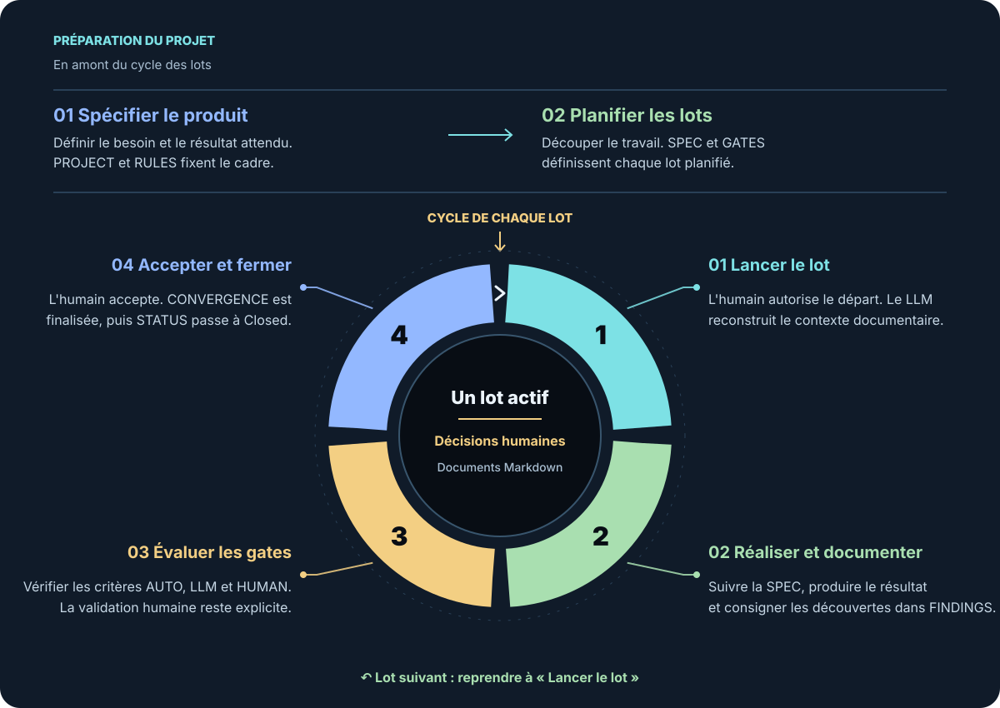

[Read this README in English](README.md)

# S.A.W. 3.2 — SDD Another Way

**Une méthode de développement guidé par les spécifications qui conserve l’intention, les décisions et les validations dans des documents Markdown lisibles.**

S.A.W. aide à déléguer le travail, à suivre son avancement et à le reprendre avec le contexte nécessaire pour continuer. Chaque unité de travail possède un objectif explicite, un périmètre défini et des conditions d’acceptation. Les exigences, les découvertes, les décisions et les résultats restent accessibles au-delà d’une conversation ou d’un changement d’outil.

La méthode peut être utilisée avec un assistant de programmation IA ou suivie manuellement. Elle ne nécessite aucun IDE, agent, fournisseur de LLM, script ou système de gestion de versions particulier : des fichiers Markdown suffisent. Les personnes conservent la responsabilité des décisions et de la validation métier.

## Fonctionnement de la méthode

Le travail est organisé en **lots** : des unités identifiables disposant de leur propre spécification et de leurs critères d’acceptation. Chaque projet S.A.W. ne comporte qu’un lot actif à la fois.

Avant de commencer le cycle, on définit le produit et son contexte, on établit les règles du projet et on planifie les lots. Chaque lot suit ensuite quatre étapes :

1. **Démarrer le lot.** Une personne autorise le démarrage ; l’exécutant lit les documents nécessaires pour reconstituer le contexte.
2. **Produire et documenter.** Le résultat est réalisé conformément à la spécification et les découvertes sont consignées au fil du travail.
3. **Évaluer les gates.** Les critères d’acceptation sont vérifiés par des contrôles déterministes, une analyse LLM ou une validation humaine explicite, selon le type de gate.
4. **Accepter et clôturer.** Une personne accepte le résultat ; le document de convergence consigne le résultat et les écarts acceptés, puis le statut du lot est mis à jour.

Le lot suivant démarre avec les connaissances conservées lors du travail précédent. Les décisions durables et les évolutions des règles sont consignées pour que les travaux futurs puissent en tenir compte.

## Une mémoire documentaire partagée

Six documents de projet fournissent le contexte de travail : `README.md`, `PROJECT.md`, `RULES.md`, `STATUS.md`, `LEDGER.md` et `HISTORY.md`. Chaque lot possède quatre documents aux rôles distincts :

| Document | Rôle |
|---|---|
| `SPEC-xxx.md` | Définir l’objectif, le périmètre et les exigences. |
| `FINDINGS-xxx.md` | Conserver les découvertes et identifier où elles doivent être traitées. |
| `GATES-xxx.md` | Définir les conditions d’acceptation et consigner les évaluations. |
| `CONVERGENCE-xxx.md` | Consigner le résultat, les écarts et les motifs de clôture. |

Ces documents conservent ce qui était prévu, ce qui a été appris, ce qui a été décidé et ce qui a été accepté. Ils permettent de transmettre le travail entre personnes ou agents sans dépendre de la mémoire d’une conversation.

## Découvrir S.A.W.

Les présentations sur **e-naxos** proposent une introduction à la méthode :

- [Présentation en français](https://www.e-naxos.com/SAW-FR/SAW-3.2-PRESENTATION.html)
- [English presentation](https://www.e-naxos.com/SAW-EN/SAW-3.2-PRESENTATION.html)

Pour les règles et les exigences du protocole, consultez les spécifications de ce dépôt :

| Langue | Spécification complète du protocole | Spécification exécutable |
|---|---|---|
| Français | [Lire la spécification complète](SAW-FR/SAW-3.2-SPECIFICATION.md) | [Lire la spécification exécutable](SAW-FR/SAW-3.2-SPECIFICATION-EXEC.md) |
| English | [Read the full specification](SAW-EN/SAW-3.2-SPECIFICATION.md) | [Read the executable specification](SAW-EN/SAW-3.2-SPECIFICATION-EXEC.md) |

La spécification complète explique le protocole en détail. La spécification exécutable le présente sous une forme compacte pour son application par une personne ou un agent ; il s’agit d’un document Markdown.

Ce dépôt contient les documents sources en français, leurs traductions en anglais, les ressources des présentations et des [captures d’écran d’exemple](CodexSamples/). Ce README présente la méthode ; les spécifications définissent le protocole.
