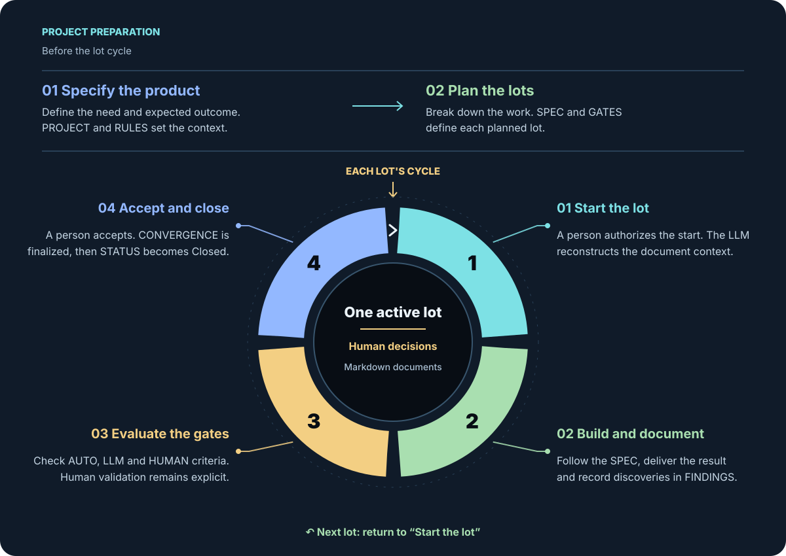

[Lire ce README en français](README.FR.MD)

# S.A.W. 3.2 — SDD Another Way

**A method for Spec-Driven Development that keeps intent, decisions and validation in readable Markdown documents.**

S.A.W. helps people delegate work, follow its progress and resume it with the context needed to continue. It gives each piece of work an explicit objective, a defined scope and conditions for acceptance. Requirements, discoveries, decisions and results remain available beyond a conversation or a change of tool.

The method can be used with an AI coding assistant or followed manually. It requires no specific IDE, agent, LLM provider, script or version control system: Markdown files are sufficient. People retain responsibility for decisions and business validation.

## How the method works

Work is organized into **lots**: identifiable units with their own specification and acceptance criteria. Each S.A.W. project has one active lot at a time.

Before starting the cycle, define the product and its context, establish the project rules, and plan the lots. Each lot then follows four stages:

1. **Start the lot.** A person authorizes the start; the executor reads the documents needed to reconstruct the context.
2. **Build and document.** Produce the result according to the specification and record discoveries as the work progresses.
3. **Evaluate the gates.** Check the acceptance criteria using deterministic checks, LLM analysis or explicit human validation, according to the type of gate.
4. **Accept and close.** A person accepts the result; the convergence document records the outcome and any accepted deviations, and the lot status is updated.

The next lot starts with the knowledge retained from the previous work. Durable decisions and changes to rules are recorded so that future work can use them.

## A shared documentary memory

Six project documents provide the working context: `README.md`, `PROJECT.md`, `RULES.md`, `STATUS.md`, `LEDGER.md` and `HISTORY.md`. Each lot has four documents with distinct roles:

| Document | Purpose |
|---|---|
| `SPEC-xxx.md` | Define the objective, scope and requirements. |
| `FINDINGS-xxx.md` | Preserve discoveries and identify where they should be handled. |
| `GATES-xxx.md` | Define acceptance conditions and record evaluations. |
| `CONVERGENCE-xxx.md` | Record the result, deviations and grounds for closure. |

Together, these documents preserve what was intended, what was learned, what was decided and what was accepted. They support handovers between people or agents without relying on conversation memory.

## Explore S.A.W.

Read the presentations on **e-naxos** for an introduction to the method:

- [English presentation](https://www.e-naxos.com/SAW-EN/SAW-3.2-PRESENTATION.html)
- [Présentation en français](https://www.e-naxos.com/SAW-FR/SAW-3.2-PRESENTATION.html)

For the protocol's rules and requirements, use the specifications in this repository:

| Language | Full protocol specification | Executable specification |
|---|---|---|
| English | [Read the full specification](SAW-EN/SAW-3.2-SPECIFICATION.md) | [Read the executable specification](SAW-EN/SAW-3.2-SPECIFICATION-EXEC.md) |
| Français | [Lire la spécification complète](SAW-FR/SAW-3.2-SPECIFICATION.md) | [Lire la spécification exécutable](SAW-FR/SAW-3.2-SPECIFICATION-EXEC.md) |

The full specification explains the protocol in detail. The executable specification presents it in a compact form for application by a person or an agent; it is a Markdown document.

This repository contains the French source documents, their English translations, presentation assets and [example screenshots](CodexSamples/). This README introduces the method; the specifications define the protocol.
